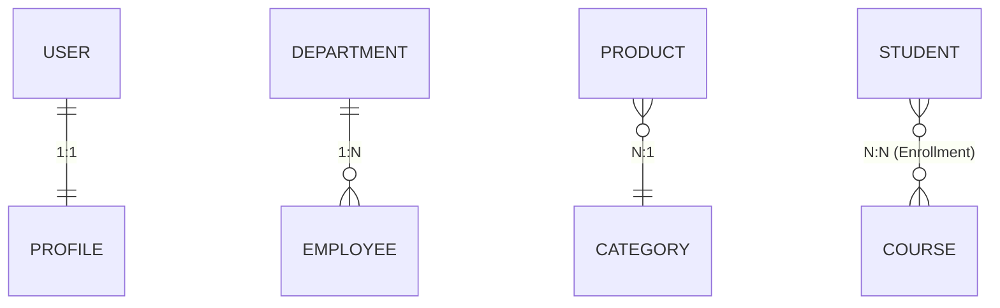
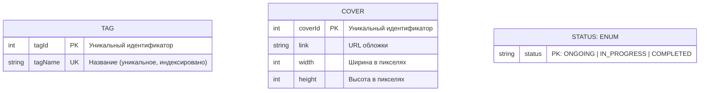
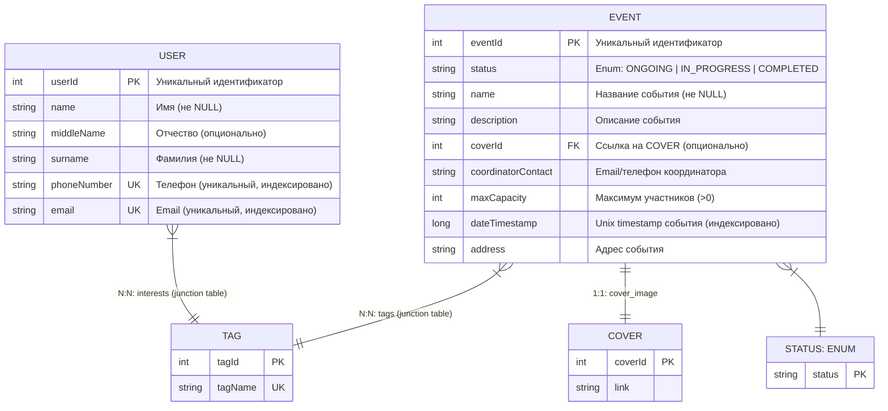

# Модель данных (ERD)

**Версия:** 1.0  
**Дата обновления:** Декабрь 2025

---

## Обзор архитектуры

Данный документ описывает логическую структуру системы, включая:

- Сущности и их атрибуты
- Отношения между сущностями
- Первичные (PK) и внешние ключи (FK)
- Ограничения целостности данных

---

<details>
<summary><h2>Справка по типам отношений</h2></summary>

### 1:1 (One-to-One) — Уникальные связи

Одна запись слева соответствует ровно одной справа.  
**Пример:** `USER ↔ PROFILE` — каждый пользователь имеет ровно один профиль.

---

### 1:N (One-to-Many) — Иерархия

Одна запись слева связана с несколькими справа.  
**Пример:** `DEPARTMENT → EMPLOYEE` — один отдел имеет множество сотрудников.

---

### N:1 (Many-to-One) — Обратная иерархия

Несколько записей слева ссылаются на одну справа.  
**Пример:** `PRODUCT → CATEGORY` — множество продуктов относятся к одной категории.

---

### N:N (Many-to-Many) — Перекрестные связи

Много записей слева связаны со многими справа.  
**Пример:** `STUDENT ↔ COURSE` через `Enrollment`.  
**Важно:** Реализуется через промежуточную таблицу (junction table).

**Графические обозначения:**



</details>

---

## Диаграмма сущностей (ERD)

### Справочные таблицы (Reference Data)



**Характеристики:**

- **TAG** — таблица интересов/категорий
- **COVER** — метаданные обложек событий
- **STATUS** — перечисление доступных статусов событий (enum)

---

### Основные сущности



---

## Детальное описание

### 1. USER

**Назначение:** Хранит информацию об участниках системы.

| Поле          | Тип          | Ключ | Индекс | Описание                       |
|---------------|--------------|------|--------|--------------------------------|
| `userId`      | INT          | PK   | ✓      | AUTO_INCREMENT, primary key    |
| `name`        | VARCHAR(100) | —    | —      | Имя (обязательное поле)        |
| `middleName`  | VARCHAR(100) | —    | —      | Отчество (NULL разрешён)       |
| `surname`     | VARCHAR(100) | —    | —      | Фамилия (обязательное поле)    |
| `phoneNumber` | VARCHAR(20)  | UK   | ✓      | Уникальное, валидация E.164    |
| `email`       | VARCHAR(255) | UK   | ✓      | Уникальное, валидация RFC 5322 |

**Ограничения:**

```sql
CONSTRAINT user_name_not_empty CHECK (LENGTH(name) > 0)
CONSTRAINT user_email_format CHECK (email LIKE '%@%.%')
CONSTRAINT user_phone_unique UNIQUE (phoneNumber)
CONSTRAINT user_email_unique UNIQUE (email)
```

**Индексы:**

```sql
CREATE INDEX idx_user_email ON USER (email);
CREATE INDEX idx_user_phone ON USER (phoneNumber);
CREATE INDEX idx_user_name ON USER (surname, name);
```

**Дополнительно:**

- Хешировать пароли отдельно в таблице `USER_AUTH`
- Реализовать системные поля `createdAt`, `updatedAt`
- Реализовать Soft delete через `deletedAt` флаг

---

### 2. EVENT

**Назначение:** Центральная сущность — описывает события и их метаданные.

| Поле                 | Тип          | Ключ | Индекс | Описание                                 |
|----------------------|--------------|------|--------|------------------------------------------|
| `eventId`            | INT          | PK   | ✓      | AUTO_INCREMENT                           |
| `status`             | ENUM         | —    | ✓      | ONGOING \| IN_PROGRESS \| COMPLETED      |
| `name`               | VARCHAR(255) | —    | ✓      | Название события (поиск)                 |
| `description`        | TEXT         | —    | —      | Описание события                         |
| `coverId`            | INT          | FK   | —      | Ссылка на COVER (1:1)                    |
| `coordinatorContact` | VARCHAR(255) | —    | —      | Email или телефон                        |
| `maxCapacity`        | INT          | —    | —      | Лимит участников                         |
| `dateTimestamp`      | BIGINT       | —    | ✓      | Unix timestamp (критично для сортировки) |
| `address`            | VARCHAR(500) | —    | —      | Полный адрес (для геолокации)            |

**Ограничения:**

```sql
CONSTRAINT event_capacity_positive CHECK (maxCapacity > 0)
CONSTRAINT event_name_not_empty CHECK (LENGTH(name) > 0)
CONSTRAINT event_timestamp_valid CHECK (dateTimestamp > 0)
CONSTRAINT event_status_valid CHECK (status IN ('ONGOING', 'IN_PROGRESS', 'COMPLETED'))
```

**Индексы:**

```sql
CREATE INDEX idx_event_status ON EVENT (status);
CREATE INDEX idx_event_date ON EVENT (dateTimestamp DESC);
CREATE INDEX idx_event_name ON EVENT (name);
CREATE INDEX idx_event_cover ON EVENT (coverId);
```

**Примечание по dateTimestamp:**

- Использовать BIGINT вместо DATETIME
- Хранить UTC+3 timezone

---

### 3. COVER

**Назначение:** Метаданные изображений-обложек для событий.

| Поле      | Тип           | Ключ | Индекс | Описание        |
|-----------|---------------|------|--------|-----------------|
| `coverId` | INT           | PK   | ✓      | AUTO_INCREMENT  |
| `link`    | VARCHAR(2048) | —    | —      | URL обложки     |
| `width`   | INT           | —    | —      | Ширина пикселей |
| `height`  | INT           | —    | —      | Высота пиксели  |

**Ограничения:**

```sql
CONSTRAINT cover_link_not_null NOT NULL (link)
CONSTRAINT cover_dimensions_positive CHECK (width > 0 AND height > 0)
CONSTRAINT cover_url_format CHECK (link LIKE 'http%')
```

---

### 4. TAG

**Назначение:** Теги для классификации событий.

| Поле      | Тип          | Ключ | Индекс | Описание       |
|-----------|--------------|------|--------|----------------|
| `tagId`   | INT          | PK   | ✓      | AUTO_INCREMENT |
| `tagName` | VARCHAR(100) | UK   | ✓      | UK             |

**Ограничения:**

```sql
CONSTRAINT tag_name_unique UNIQUE (tagName)
CONSTRAINT tag_name_not_empty CHECK (LENGTH(tagName) > 0)
```

**Индексы:**

```sql
CREATE INDEX idx_tag_name ON TAG (tagName);
```

---

### 5. STATUS (Перечисление)

**Назначение:** Статусы событий.

| Значение      | Описание                  |
|---------------|---------------------------|
| `ONGOING`     | Событие анонсировано      |
| `IN_PROGRESS` | Событие идёт прямо сейчас |
| `COMPLETED`   | Событие завершено         |

---

## Связи между сущностями

### 1:1: EVENT → COVER

```
EVENT (1) ──── (1) COVER
         has_cover
```

- Одно событие имеет максимум одну обложку
- Допустимо значение NULL
- Каскадное удаление

**SQL:**

```sql
ALTER TABLE EVENT
    ADD CONSTRAINT fk_event_cover
        FOREIGN KEY (coverId) REFERENCES COVER (coverId)
            ON DELETE CASCADE ON UPDATE CASCADE;
```

**Примечание:** Если обложка удалена, событие остаётся (обложка может быть переиспользована).

---

### N:N: USER ↔ TAG

```
USER (N) ───── (N) TAG
      through: USER_TAG
```

- Пользователь может иметь много интересов
- Требует промежуточной таблицы

**Структура промежуточной таблицы:**

```sql
CREATE TABLE USER_TAG
(
    userId  INT NOT NULL,
    tagId   INT NOT NULL,
    addedAt TIMESTAMP DEFAULT CURRENT_TIMESTAMP,

    PRIMARY KEY (userId, tagId),
    FOREIGN KEY (userId) REFERENCES USER (userId) ON DELETE CASCADE,
    FOREIGN KEY (tagId) REFERENCES TAG (tagId) ON DELETE CASCADE
);

CREATE INDEX idx_user_tags ON USER_TAG (userId);
CREATE INDEX idx_tag_users ON USER_TAG (tagId);
```

---

### N:N: EVENT ↔ TAG

```
EVENT (N) ───── (N) TAG
     through: EVENT_TAG
```

- Событие может быть помечено несколькими тегами
- Требует промежуточной таблицы

**Структура промежуточной таблицы:**

```sql
CREATE TABLE EVENT_TAG
(
    eventId INT NOT NULL,
    tagId   INT NOT NULL,
    addedAt TIMESTAMP DEFAULT CURRENT_TIMESTAMP,

    PRIMARY KEY (eventId, tagId),
    FOREIGN KEY (eventId) REFERENCES EVENT (eventId) ON DELETE CASCADE,
    FOREIGN KEY (tagId) REFERENCES TAG (tagId) ON DELETE CASCADE
);

CREATE INDEX idx_event_tags ON EVENT_TAG (eventId);
CREATE INDEX idx_tag_events ON EVENT_TAG (tagId);
```

---

## Примеры запросов (SQL)

### 1. Найти все события определённой категории

```sql
SELECT DISTINCT e.*
FROM EVENT e
         JOIN EVENT_TAG et ON e.eventId = et.eventId
         JOIN TAG t ON et.tagId = t.tagId
WHERE t.tagName = 'Technology'
  AND e.status = 'ONGOING'
ORDER BY e.dateTimestamp ASC;
```

### 2. Получить рекомендации пользователя

```sql
SELECT DISTINCT e.eventId, e.name, e.dateTimestamp, COUNT(et.tagId) as matchCount
FROM EVENT e
         JOIN EVENT_TAG et ON e.eventId = et.eventId
         JOIN TAG t ON et.tagId = t.tagId
         JOIN USER_TAG ut ON t.tagId = ut.tagId
WHERE ut.userId = ?
  AND e.status = 'ONGOING'
GROUP BY e.eventId
ORDER BY matchCount DESC, e.dateTimestamp ASC LIMIT 10;
```

### 3. Получить информацию об организаторе события с обложкой

```sql
SELECT e.eventId, e.name, e.description, c.link, c.width, c.height
FROM EVENT e
         LEFT JOIN COVER c ON e.coverId = c.coverId
WHERE e.eventId = ?;
```

### 4. Получить все теги для события

```sql
SELECT t.tagId, t.tagName
FROM TAG t
         JOIN EVENT_TAG et ON t.tagId = et.tagId
WHERE et.eventId = ?
ORDER BY t.tagName;
```

---

## Рекомендации по масштабированию

### Производительность

1. **Partitioning по `dateTimestamp`** (таблица EVENT)
   ```sql
   PARTITION BY RANGE (YEAR(FROM_UNIXTIME(dateTimestamp))) (
       PARTITION p2023 VALUES LESS THAN (2024),
       PARTITION p2024 VALUES LESS THAN (2025),
       PARTITION p2025 VALUES LESS THAN (2026)
   );
   ```

2. **Кэширование (Redis)**
    - Кэшировать `event:{eventId}`
    - Кэшировать `user:{userId}:recommendations`
    - TTL: 1 час для событий, 30 мин для рекомендаций

3. **Индексирование полнотекстового поиска с помощью ElasticSearch**

---

## Версионирование схемы

| Версия | Дата     | Изменения             |
|--------|----------|-----------------------|
| 1.0    | Дек 2025 | Первоначальная версия |
