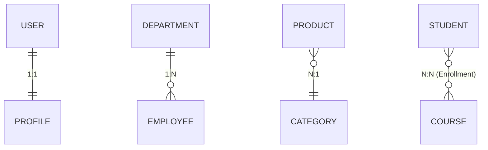
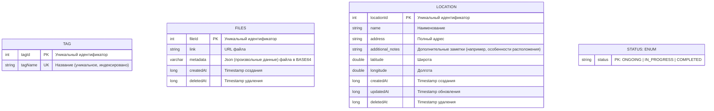
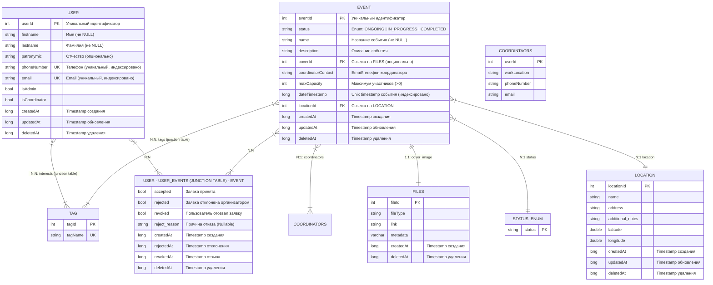

# Модель данных (ERD)

**Версия:** 1.1
**Дата обновления:** Декабрь 2025

---

## Обзор архитектуры

Данный документ описывает логическую структуру системы, включая:

- Сущности и их атрибуты
- Отношения между сущностями
- Первичные (PK) и внешние ключи (FK)
- Ограничения целостности данных

---

<details>
<summary><h2>Справка по типам отношений</h2></summary>

### 1:1 (One-to-One) - Уникальные связи

Одна запись слева соответствует ровно одной справа.
**Пример:** `USER ↔ PROFILE` - каждый пользователь имеет ровно один профиль.

---

### 1:N (One-to-Many) - Иерархия

Одна запись слева связана с несколькими справа.  
**Пример:** `DEPARTMENT → EMPLOYEE` - один отдел имеет множество сотрудников.

---

### N:1 (Many-to-One) - Обратная иерархия

Несколько записей слева ссылаются на одну справа.  
**Пример:** `PRODUCT → CATEGORY` - множество продуктов относятся к одной категории.

---

### N:N (Many-to-Many) - Перекрестные связи

Много записей слева связаны со многими справа.  
**Пример:** `STUDENT ↔ COURSE` через `Enrollment`.  
**Важно:** Реализуется через промежуточную таблицу (junction table).

**Графические обозначения:**


```mermaid
erDiagram
    USER ||--|| PROFILE: "1:1"
    DEPARTMENT ||--o{ EMPLOYEE: "1:N"
    PRODUCT }o--|| CATEGORY: "N:1"
    STUDENT }o--o{ COURSE: "N:N (Enrollment)"
```

</details>

---

## Диаграмма сущностей (ERD)

### Справочные таблицы (Reference Data)


```mermaid
erDiagram
    TAG {
        int tagId PK "Уникальный идентификатор"
        string tagName UK "Название (уникальное, индексировано)"
    }

    FILES {
        int fileId PK "Уникальный идентификатор"
        string link "URL файла"
        varchar metadata "Json (произвольные данные) файла в BASE64"
        long createdAt "Timestamp создания"
        long deletedAt "Timestamp удаления"
    }

    LOCATION {
        int locationId PK "Уникальный идентификатор"
        string name "Наименование"
        string address "Полный адрес"
        string additional_notes "Дополнительные заметки (например, особенности расположения)"
        double latitude "Широта"
        double longitude "Долгота"
        long createdAt "Timestamp создания"
        long updatedAt "Timestamp обновления"
        long deletedAt "Timestamp удаления"
    }

    STATUS["STATUS: ENUM"] {
        string status "PK: ONGOING | IN_PROGRESS | COMPLETED"
    }
```

- **TAG** - таблица интересов/категорий
- **FILES** - метаданные фалов S3
- **LOCATION** - метаданные адресов событий
- **STATUS** - перечисление доступных статусов событий (enum)

---

### Основные сущности


```mermaid
erDiagram
    USER_EVENTS["USER - USER_EVENTS (JUNCTION TABLE) - EVENT"] {
        bool accepted "Заявка принята"
        bool rejected "Заявка отклонена организатором"
        bool revoked "Пользователь отозвал заявку"
        string reject_reason "Причина отказа (Nullable)"
        long createdAt "Timestamp создания"
        long rejectedAt "Timestamp отклонения"
        long revokedAt "Timestamp отзыва"
        long deletedAt "Timestamp удаления"
    }

    USER {
        int userId PK "Уникальный идентификатор"
        string firstname "Имя (не NULL)"
        string lastname "Фамилия (не NULL)"
        string patronymic "Отчество (опционально)"
        string phoneNumber UK "Телефон (уникальный, индексировано)"
        string email UK "Email (уникальный, индексировано)"
        bool isAdmin
        bool isCoordinator
        long createdAt "Timestamp создания"
        long updatedAt "Timestamp обновления"
        long deletedAt "Timestamp удаления"
    }

    EVENT {
        int eventId PK "Уникальный идентификатор"
        string status "Enum: ONGOING | IN_PROGRESS | COMPLETED"
        string name "Название события (не NULL)"
        string description "Описание события"
        int coverId FK "Ссылка на FILES (опционально)"
        string coordinatorContact "Email/телефон координатора"
        int maxCapacity "Максимум участников (>0)"
        long dateTimestamp "Unix timestamp события (индексировано)"
        int locationId FK "Ссылка на LOCATION"
        long createdAt "Timestamp создания"
        long updatedAt "Timestamp обновления"
        long deletedAt "Timestamp удаления"
    }

    TAG {
        int tagId PK
        string tagName UK
    }

    FILES {
        int fileId PK
        string fileType
        string link
        varchar metadata
        long createdAt "Timestamp создания"
        long deletedAt "Timestamp удаления"
    }

    COORDINTAORS {
        int userId PK
        string workLocation
        string phoneNumber
        string email
    }

    LOCATION {
        int locationId PK
        string name
        string address
        string additional_notes
        double latitude
        double longitude
        long createdAt "Timestamp создания"
        long updatedAt "Timestamp обновления"
        long deletedAt "Timestamp удаления"
    }

    STATUS["STATUS: ENUM"] {
        string status PK
    }

    USER }|--|{ TAG: "N:N: interests (junction table)"
    USER }|--|{ USER_EVENTS: "N:N"
    EVENT }|--|{ COORDINATORS: "N:1: coordinators"
    EVENT }|--|{ USER_EVENTS: "N:N"
    EVENT }|--|{ TAG: "N:N: tags (junction table)"
    EVENT ||--|| FILES: "1:1: cover_image"
    EVENT }|--|| STATUS: "N:1 status"
    EVENT }|--|| LOCATION: "N:1 location"
```

---

## Детальное описание

### 1. USER

**Назначение:** Хранит информацию об участниках системы.

| Поле             | Тип          | Ключ | Индекс | Описание                                 |
|------------------|--------------|------|--------|------------------------------------------|
| `userId`         | INT          | PK   | ✓      | AUTO_INCREMENT, primary key              |
| `firstname`      | VARCHAR(100) | -    | -      | Имя (обязательное поле)                  |
| `lastname`       | VARCHAR(100) | -    | -      | Фамилия (обязательное поле)              |
| `patronymic`     | VARCHAR(100) | -    | -      | Отчество (NULL разрешён)                 |
| `phoneNumber`    | VARCHAR(20)  | UK   | ✓      | Уникальное, валидация E.164              |
| `email`          | VARCHAR(255) | UK   | ✓      | Уникальное, валидация RFC 5322           |
| `password_hash ` | VARCHAR(255) | -    | -      | Хеш пароля                               |
| `isAdmin`        | BOOL         | -    | -      | Является ли пользователь администратором |
| `isCoordinator`  | BOOL         | -    | -      | Является ли пользователь координатором   |
| `createdAt`      | LONG         | -    | -      | Timestamp создания                       |
| `updatedAt`      | LONG         | -    | -      | Timestamp обновления                     |
| `deletedAt`      | LONG         | -    | -      | Timestamp удаления                       |

---

### 2. COORDINATORS

**Назначение:** Хранит информацию об участниках системы.

| Поле           | Тип          | Ключ | Индекс | Описание                       |
|----------------|--------------|------|--------|--------------------------------|
| `userId`       | INT          | PK   | ✓      | Ссылка на USER, primary key    |
| `workLocation` | VARCHAR(255) | -    | -      | Место работы                   |
| `email`        | VARCHAR(100) | -    | -      | Уникальное, валидация RFC 5322 |
| `phoneNumber`  | VARCHAR(20)  | -    | -      | Уникальное, валидация E.164    |

### 3. EVENT

**Назначение:** Центральная сущность - описывает события и их метаданные.

| Поле                 | Тип          | Ключ | Индекс | Описание                            |
|----------------------|--------------|------|--------|-------------------------------------|
| `eventId`            | INT          | PK   | ✓      | AUTO_INCREMENT                      |
| `status`             | ENUM         | -    | ✓      | ONGOING \| IN_PROGRESS \| COMPLETED |
| `name`               | VARCHAR(255) | -    | ✓      | Название события (поиск)            |
| `description`        | TEXT         | -    | -      | Описание события                    |
| `coverId`            | INT          | FK   | -      | Ссылка на FILES (1:1)               |
| `coordinatorContact` | VARCHAR(255) | -    | -      | Email или телефон                   |
| `maxCapacity`        | INT          | -    | -      | Лимит участников                    |
| `dateTimestamp`      | BIGINT       | -    | ✓      | Unix timestamp                      |
| `locationId`         | INT          | FK   | -      | Ссылка на LOCATION (N:1)            |
| `createdAt`          | LONG         | -    | -      | Timestamp создания                  |
| `updatedAt`          | LONG         | -    | -      | Timestamp обновления                |
| `deletedAt`          | LONG         | -    | -      | Timestamp удаления                  |

**Примечание по dateTimestamp:**

- Использовать BIGINT вместо DATETIME
- Хранить UTC+3 timezone

---

### 4. FILES

**Назначение:** Метаданные файлов в S3 хранилище.

| Поле        | Тип                | Ключ | Индекс | Описание                                  |
|-------------|--------------------|------|--------|-------------------------------------------|
| `fileId`    | INT                | PK   | ✓      | AUTO_INCREMENT                            |
| `link`      | VARCHAR(2048)      | -    | -      | S3 URL на файл                            |
| `metadata`  | VARCHAR(unlimited) | -    | -      | Json (произвольные данные) файла в BASE64 |
| `createdAt` | LONG               | -    | -      | Timestamp создания                        |
| `deletedAt` | LONG               | -    | -      | Timestamp удаления                        |

---

### 5. TAG

**Назначение:** Теги для классификации событий.

| Поле      | Тип          | Ключ | Индекс | Описание       |
|-----------|--------------|------|--------|----------------|
| `tagId`   | INT          | PK   | ✓      | AUTO_INCREMENT |
| `tagName` | VARCHAR(100) | UK   | ✓      | UK             |

---

### 6. STATUS (Перечисление)

**Назначение:** Статусы событий.

| Значение      | Описание                  |
|---------------|---------------------------|
| `ONGOING`     | Событие анонсировано      |
| `IN_PROGRESS` | Событие идёт прямо сейчас |
| `COMPLETED`   | Событие завершено         |

---

### 7. LOCATION

**Назначение:** Метаданные адреса события.

| Поле               | Тип          | Ключ | Индекс | Описание                               |
|--------------------|--------------|------|--------|----------------------------------------|
| `locationId`       | INT          | PK   | ✓      | AUTO_INCREMENT                         |
| `name`             | VARCHAR(512) | -    | -      | Наименование                           |
| `address`          | VARCHAR(512) | -    | -      | Полный адрес проведения                |
| `additional_notes` | VARCHAR(512) | -    | -      | Дополнительные заметки по расположению |
| `latitude`         | FLOAT        | -    | -      | Широта                                 |
| `longitude`        | FLOAT        | -    | -      | Долгота                                |
| `createdAt`        | LONG         | -    | -      | Timestamp создания                     |
| `updatedAt`        | LONG         | -    | -      | Timestamp обновления                   |
| `deletedAt`        | LONG         | -    | -      | Timestamp удаления                     |

---

## Связи между сущностями

### 1:1: EVENT → FILES

```
EVENT (1) ──── (1) FILES
         has_cover
```

- Одно событие имеет максимум одну обложку
- Допустимо значение NULL
- Каскадное удаление/обновление

### N:1: EVENT → LOCATION

```
EVENT (N) ───── (1) LOCATION
```

- Несколько событий могут иметь одну локацию

---

### N:1: EVENT → COORDINATORS

```
EVENT (N) ───── (1) COORDINATORS
```

- Несколько событий могут иметь одного координатора

---

### N:N: USER ↔ TAG

```
USER (N) ───── (N) TAG
      through: USER_TAG
```

- Пользователь может иметь много интересов
- Требует промежуточной таблицы

**Структура промежуточной таблицы:**

---

### N:N: USER ↔ EVENT

```
USER (N) ───── (N) EVENT
     through: USER_EVENTS
```

- Пользователь может участвовать в нескольких событиях
- Требует промежуточной таблицы

**Структура промежуточной таблицы:**

---

### N:N: EVENT ↔ TAG

```
EVENT (N) ───── (N) TAG
     through: EVENT_TAG
```

- Событие может быть помечено несколькими тегами
- Требует промежуточной таблицы

## Версионирование схемы

| Версия | Дата     | Изменения                                                                                                                                                                    |
|--------|----------|------------------------------------------------------------------------------------------------------------------------------------------------------------------------------|
| 1.0    | Дек 2025 | Первоначальная версия                                                                                                                                                        |
| 1.1    | Дек 2025 | Исправления в соответствии с [запросом #5](https://github.com/ADT-VOLUNTEERS-CASE/.github/issues/5)                                                                          |
| 1.2    | Янв 2026 | Исправления в соответствии с [запросом #7](https://github.com/ADT-VOLUNTEERS-CASE/.github/issues/7) и [запросом #8](https://github.com/ADT-VOLUNTEERS-CASE/.github/issues/8) |
